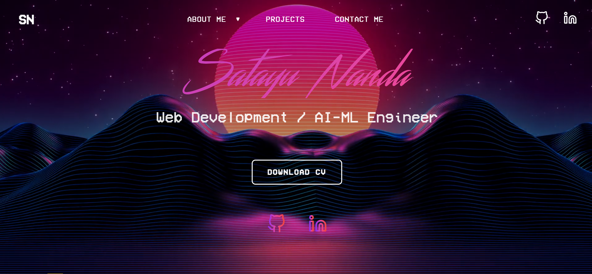

# Satayu Nanda - Developer Portfolio



A responsive and animated personal portfolio website built with HTML, CSS, and JavaScript. The project showcases my skills, experience, and projects in a visually engaging, retro-futuristic synthwave theme.

---

### **Live Demo**

🚀 **[View the live site here!](https://your-username.github.io/your-repository-name/)**

---

### **Features**

-   **Fully Responsive:** Optimized for a seamless experience on desktops, tablets, and mobile devices.
-   **Animated Hero Section:** Eye-catching text and gradient animations on the main landing section.
-   **Interactive Timeline:** A scroll-animated timeline for education and work experience.
-   **Dynamic Content:** Sections for projects, skills, and education that are easy to update.
-   **Functional Contact Form:** An EmailJS-integrated contact form that sends messages directly to my inbox.
-   **Glassmorphism UI:** Modern, frosted-glass effects on UI cards and the navigation bar.

---

### **Technologies Used**

-   **HTML5:** For the structure and content of the website.
-   **CSS3:** For custom styling, animations, and responsive design.
-   **JavaScript (ES6+):** For DOM manipulation, scroll animations, and handling the contact form.
-   **EmailJS:** To power the contact form without needing a backend server.
-   **GitHub Pages:** For hosting the live version of the website.

---

### **Local Setup**

To run this project on your local machine, follow these steps:

1.  **Clone the repository:**
    ```bash
    git clone [https://github.com/your-username/your-repository-name.git](https://github.com/your-username/your-repository-name.git)
    ```
2.  **Navigate to the project directory:**
    ```bash
    cd your-repository-name
    ```
3.  **Open `index.html` in your browser:**
    -   You can simply double-click the `index.html` file in your file explorer.

---

### **Contact**

Feel free to reach out to me!

-   **LinkedIn:** [Satayu Nanda](https://www.linkedin.com/in/satayu-nanda-26325729b/)
-   **GitHub:** [@nandasatayu](https://github.com/nandasatayu)
